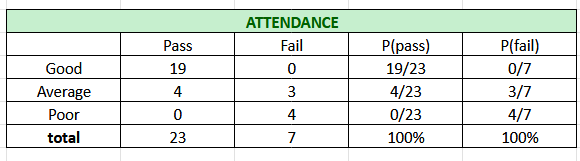
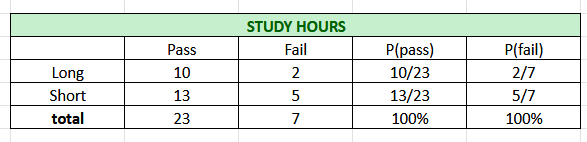
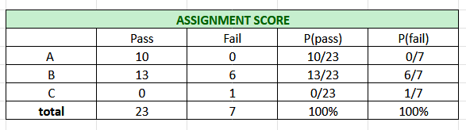
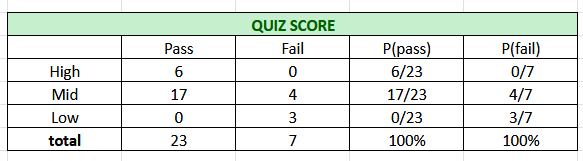
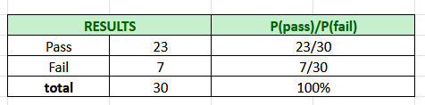

# Group 2 -Guleng, Hadjinor, Rico

STUDENT PERFORMANCE PREDICTION

One of the commonly used techniques for student performance prediction is the Naive Bayes classifier, a probabilistic algorithm based on Bayes' Theorem. This method calculates the probability that a student will pass or fail based on several independent features. Because of its simplicity, efficiency, and good performance on small datasets, Naive Bayes is widely used in educational research and classification problems.

Predicting student performance helps instructors make better decisions in monitoring student progress. For example, students with poor attendance or low quiz scores may be identified early, allowing teachers to provide guidance or intervention before final examinations. This improves learning outcomes and reduces the number of failing students.

In this study, student performance prediction is done using features such as attendance, study hours, assignment score, and quiz score, and the result is classified into Pass or Fail using the Naive Bayes classification formula. The goal is to demonstrate how probability-based classification can be applied to real educational data to support decision-making in academic environments.

Features/Factors:
1. Attendance - Good, Average, Poor
2. Study Hours - Long, Short
3. Assignment Score - A, B, C
4. Quiz Score - High, Mid, Low
5. Results - Pass, Fail

DATASETS
| Student | ATTENDANCE | STUDY HOURS | ASSIGNMENT SCORE | QUIZ SCORE | RESULTS |
| :--- | :--- | :--- | :--- | :--- | :--- |
| S1 | Good | Short | B | Mid | Pass |
| S2 | Good | Long | A | Mid | Pass |
| S3 | Good | Short | B | Mid | Pass |
| S4 | Good | Short | B | Mid | Pass |
| S5 | Good | Long | A | Mid | Pass |
| S6 | Good | Short | B | Mid | Pass |
| S7 | Good | Long | B | Mid | Pass |
| S8 | Good | Short | B | Mid | Pass |
| S9 | Good | Short | B | Mid | Pass |
| S10 | Good | Short | B | Mid | Pass |
| S11 | Good | Long | A | High | Pass |
| S12 | Average | Short | B | Low | Fail |
| S13 | Average | Long | B | Mid | Fail |
| S14 | Good | Short | B | Mid | Pass |
| S15 | Average | Long | B | Mid | Fail |
| S16 | Poor | Short | B | Low | Fail |
| S17 | Poor | Short | C | Mid | Fail |
| S18 | Good | Long | A | Mid | Pass |
| S19 | Good | Short | B | Mid | Pass |
| S20 | Good | Short | B | Mid | Pass |
| S21 | Good | Short | A | High | Pass |
| S22 | Average | Long | A | High | Pass |
| S23 | Poor | Short | B | Mid | Fail |
| S24 | Good | Long | A | High | Pass |
| S25 | Good | Long | B | High | Pass |
| S26 | Average | Short | A | Mid | Pass |
| S27 | Poor | Short | B | Low | Fail |
| S28 | Average | Long | A | High | Pass |
| S29 | Good | Short | A | Mid | Pass |
| S30 | Average | Long | B | Mid | Pass |
<<<<<<< HEAD

=======
>>>>>>> ef9d9f25a22a04654dff3605c9408bb3959d2220

# Survey Summary Charts
#### Attendance

#### Study Hours 

#### Assignment Score 

#### Quiz Score 

# Overall Result
